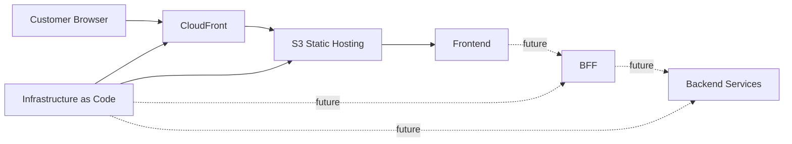

# Sashalosh Engineering

Sashalosh Engineering documentation provides a centralized, versioned view of the systems, services, infrastructure, and tools that support `https://sashalosh.shop`.

Each code repository owns its own technical documentation. Repository documentation is published into this site so engineers can discover current system information from either the source repository or the documentation portal.

## System Architecture

## Engineering Domains
### Frontend

The frontend contains the customer-facing Sashalosh application, including pages, UI components, assets, and frontend tooling.

[View Frontend Documentation](../frontend/README.md)

### Infrastructure

Infrastructure documentation describes the AWS resources and deployment architecture supporting Sashalosh.

[View Infrastructure Documentation](../infrastructure/README.md)

### Backend for Frontend

The BFF is a planned application layer that will provide frontend-specific APIs and orchestration as backend functionality is introduced.

[View BFF Documentation](../bff/README.md)

## Application Tools

Shared engineering tools that apply across multiple repositories or teams are documented here.

Examples may include:

- documentation publishing tools
- repository templates
- documentation validation
- link checking
- shared developer utilities